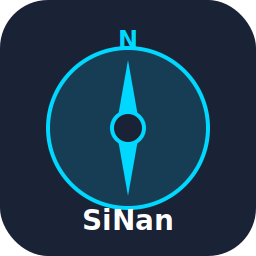

# SiNan

<div align="center">



[](https://dotnet.microsoft.com/)
[](LICENSE)
[]()

**现代化的 .NET 服务注册、发现与配置管理平台**

[English](README.md) | 简体中文

[功能特性](#-功能特性) • [快速开始](#-快速开始) • [文档](#-文档中心) • [API 参考](#api-端点概览)

</div>

---

## 📖 项目简介

SiNan 是一个基于 .NET 10 和 .NET Aspire 构建的服务注册/发现与配置管理平台，灵感来源于 Nacos。它为微服务架构提供了完整的基础设施解决方案，核心功能包括：

- **服务注册与发现**：动态服务注册、健康检查和长轮询订阅机制
- **配置管理**：集中式配置管理，支持版本控制、回滚和实时更新
- **安全与审计**：API 密钥认证、基于 RBAC 的权限控制和完整审计日志
- **高可用性**：面向生产环境设计，支持配额管理和高可用部署
- **开发者友好**：Web 管理控制台、.NET SDK 和详尽的 API 文档

## ✨ 功能特性

### 服务注册与发现
- ✅ 服务实例注册与注销
- ✅ 基于心跳的健康监控
- ✅ 实例查询（支持健康/全部实例过滤）
- ✅ 基于 ETag 的长轮询订阅
- ✅ 服务列表和元数据管理
- ✅ 临时实例支持

### 配置管理
- ✅ 配置项的增删改查操作
- ✅ 版本历史记录
- ✅ 配置回滚到任意版本
- ✅ 实时更新的长轮询订阅
- ✅ 多命名空间和分组支持
- ✅ 多种内容类型支持（text、JSON、YAML 等）
- ✅ 自动历史记录清理

### 安全与合规
- ✅ API 密钥认证（可选）
- ✅ 基于命名空间/分组隔离的 RBAC
- ✅ 操作级别和资源级别的权限控制
- ✅ 完整的审计日志记录
- ✅ 管理员审计查询 API

### 运维与管理
- ✅ 基于 Web 的管理控制台
- ✅ 配额管理（服务、实例、配置）
- ✅ OpenTelemetry 集成
- ✅ 健康检查和指标监控
- ✅ 支持 SQLite 和 MySQL 数据库

## 🏗️ 系统架构

```
┌─────────────────────────────────────────────────────────────┐
│                     SiNan 平台                               │
├─────────────────────────────────────────────────────────────┤
│                                                               │
│  ┌─────────────┐  ┌──────────────┐  ┌──────────────┐       │
│  │  Web 控制台  │  │  SDK/.NET   │  │  HTTP 客户端 │       │
│  │   (Web UI)  │  │    客户端    │  │  (任意语言)   │       │
│  └──────┬──────┘  └──────┬───────┘  └──────┬───────┘       │
│         │                │                  │                │
│         └────────────────┴──────────────────┘                │
│                          │                                   │
│         ┌────────────────▼────────────────┐                 │
│         │     API 网关 / 中间件           │                 │
│         │   (认证、审计、流量控制)         │                 │
│         └────────────────┬────────────────┘                 │
│                          │                                   │
│    ┌─────────────────────┴─────────────────────┐            │
│    │                                            │            │
│    ▼                                            ▼            │
│ ┌──────────────────┐              ┌──────────────────┐     │
│ │   注册中心服务    │              │    配置服务      │     │
│ │   - 注册         │              │   - 获取/设置     │     │
│ │   - 心跳         │              │   - 订阅         │     │
│ │   - 订阅         │              │   - 回滚         │     │
│ │   - 查询         │              │   - 历史记录     │     │
│ └────────┬─────────┘              └────────┬─────────┘     │
│          │                                  │               │
│          └──────────────┬───────────────────┘               │
│                         │                                   │
│              ┌──────────▼─────────┐                         │
│              │     存储层         │                         │
│              │  (SQLite / MySQL)  │                         │
│              └────────────────────┘                         │
│                                                              │
└──────────────────────────────────────────────────────────────┘
```

## 📁 仓库结构

```
SiNan/
├── SiNan.AppHost/              # .NET Aspire 编排
├── SiNan.ServiceDefaults/      # Aspire 共享配置
├── SiNan.Server/               # 核心 API 服务器
│   ├── Controllers/            # API 控制器
│   │   ├── RegistryController.cs
│   │   ├── ConfigController.cs
│   │   └── AuditController.cs
│   ├── Auth/                   # 认证与授权
│   ├── Config/                 # 配置服务
│   ├── Registry/               # 注册中心服务
│   ├── Storage/                # 数据访问层
│   ├── Helpers/                # 工具类
│   └── Program.cs              # 应用程序入口
├── SiNan.Console/              # Web 管理控制台
├── SiNan.SDK/                  # .NET 客户端 SDK
├── SiNan.Server.Tests/         # 单元测试
├── docs/                       # 文档
│   ├── registry-api.md
│   ├── config-api.md
│   ├── audit-api.md
│   └── ha-load-test-plan.md
└── requirements.md             # 产品需求文档

```

## 🚀 快速开始

### 前置要求

- [.NET SDK 10.0](https://dotnet.microsoft.com/download/dotnet/10.0) 或更高版本
- [Docker](https://www.docker.com/)（可选，用于容器化部署）
- [Docker Compose](https://docs.docker.com/compose/)（可选，用于多容器部署）

### 方式一：使用 .NET Aspire 进行本地开发

最快的开发启动方式：

```bash
# 克隆仓库
git clone https://github.com/MiaoShuYo/SiNan.git
cd SiNan

# 使用 Aspire 编排运行
dotnet run --project SiNan.AppHost
```

访问服务：
- **API 服务器**：http://localhost:5043
- **Web 控制台**：http://localhost:5044
- **Aspire 仪表板**：http://localhost:15888

### 方式二：Docker 容器

将 SiNan Server 作为独立 Docker 容器运行：

```bash
# 构建镜像
docker build -t sinan-server ./SiNan.Server

# 使用 SQLite 运行（默认）
docker run -d -p 5043:8080 \
  --name sinan-server \
  sinan-server

# 使用 MySQL 运行
docker run -d -p 5043:8080 \
  -e Data__Provider=MySql \
  -e ConnectionStrings__SiNan="Server=mysql;Database=sinan;User=root;Password=password;" \
  --name sinan-server \
  sinan-server
```

### 方式三：Docker Compose（生产环境推荐）

使用 MySQL 的完整部署：

```bash
# 启动所有服务
docker compose up -d

# 查看日志
docker compose logs -f

# 停止服务
docker compose down
```

仅使用 SQLite 部署：

```bash
docker compose --profile sqlite up -d
```

### 验证安装

测试 API：

```bash
# 健康检查
curl http://localhost:5043/health

# 注册服务
curl -X POST http://localhost:5043/api/v1/registry/register \
  -H "Content-Type: application/json" \
  -d '{
    "namespace": "default",
    "group": "DEFAULT_GROUP",
    "serviceName": "demo-service",
    "host": "127.0.0.1",
    "port": 8080,
    "weight": 100,
    "ttlSeconds": 30,
    "isEphemeral": true
  }'

# 查询实例
curl http://localhost:5043/api/v1/registry/instances?namespace=default&group=DEFAULT_GROUP&serviceName=demo-service
```

## ⚙️ 配置说明

### 数据库配置

在 `appsettings.json` 中配置数据库提供程序：

**SQLite（默认）：**
```json
{
  "Data": {
    "Provider": "Sqlite"
  },
  "ConnectionStrings": {
    "SiNan": "Data Source=sinan.db"
  }
}
```

**MySQL：**
```json
{
  "Data": {
    "Provider": "MySql"
  },
  "ConnectionStrings": {
    "SiNan": "Server=localhost;Database=sinan;User=root;Password=your_password;"
  }
}
```

### 认证与授权

启用 API 密钥认证：

```json
{
  "Auth": {
    "Enabled": true,
    "HeaderName": "X-SiNan-Token",
    "ActorHeaderName": "X-SiNan-Actor",
    "ApiKeys": [
      {
        "Key": "admin-secret-token-12345",
        "Actor": "admin",
        "IsAdmin": true,
        "Namespaces": [],
        "Groups": [],
        "AllowedActions": [],
        "AllowedResources": []
      },
      {
        "Key": "app-token-67890",
        "Actor": "application",
        "IsAdmin": false,
        "Namespaces": ["default", "production"],
        "Groups": ["DEFAULT_GROUP"],
        "AllowedActions": [
          "registry.register",
          "registry.deregister",
          "registry.heartbeat",
          "registry.read",
          "config.read"
        ],
        "AllowedResources": [
          "registry:default/DEFAULT_GROUP/",
          "config:default/DEFAULT_GROUP/"
        ]
      }
    ]
  }
}
```

**权限模型：**
- `IsAdmin`：授予审计日志访问权限并绕过操作检查
- `Namespaces`：限制特定命名空间（为空表示允许全部）
- `Groups`：限制特定分组（为空表示允许全部）
- `AllowedActions`：限制特定操作（为空表示允许全部）
- `AllowedResources`：基于前缀的资源过滤（为空表示允许全部）

**可用操作：**
- 注册中心：`registry.register`、`registry.deregister`、`registry.heartbeat`、`registry.read`
- 配置：`config.create`、`config.update`、`config.delete`、`config.rollback`、`config.read`、`config.history`
- 审计：`audit.read`（需要 `IsAdmin: true`）

### 配额管理

为每个命名空间配置资源限制：

```json
{
  "Quota": {
    "MaxServicesPerNamespace": 1000,
    "MaxInstancesPerNamespace": 5000,
    "MaxConfigsPerNamespace": 500,
    "MaxConfigContentLength": 65535
  }
}
```

设置为 `0` 以禁用特定配额检查。

### 健康检查与清理

```json
{
  "Registry": {
    "Health": {
      "CheckIntervalSeconds": 5,
      "MarkUnhealthyAfterSeconds": 30
    }
  },
  "Config": {
    "HistoryCleanup": {
      "Enabled": true,
      "IntervalHours": 24,
      "RetainVersions": 10,
      "RetainDays": 90
    }
  }
}
```

## 📚 文档中心

### API 参考

- [注册中心 API 文档](docs/registry-api.zh-CN.md) ([English](docs/registry-api.md)) - 服务注册、发现和订阅
- [配置管理 API 文档](docs/config-api.zh-CN.md) ([English](docs/config-api.md)) - 配置管理和版本控制
- [审计日志 API 文档](docs/audit-api.zh-CN.md) ([English](docs/audit-api.md)) - 审计日志查询
- [高可用与压测](docs/ha-load-test-plan.zh-CN.md) ([English](docs/ha-load-test-plan.md)) - 高可用部署指南

### API 端点概览

**注册中心服务** (`/api/v1/registry`)
- `POST /register` - 注册服务实例
- `POST /deregister` - 注销实例
- `POST /heartbeat` - 发送心跳
- `GET /instances` - 查询实例
- `GET /subscribe` - 订阅实例变更
- `GET /services` - 列出所有服务

**配置服务** (`/api/v1/configs`)
- `POST /` - 创建配置
- `PUT /` - 更新配置
- `GET /` - 获取配置
- `DELETE /` - 删除配置
- `GET /history` - 获取版本历史
- `POST /rollback` - 回滚到指定版本
- `GET /list` - 列出配置
- `GET /subscribe` - 订阅配置变更

**审计服务** (`/api/v1/audit`)
- `GET /` - 查询审计日志（仅管理员）

## 💻 .NET SDK 使用指南

### 安装

```bash
dotnet add package SiNan.SDK
```

### 基础用法

```csharp
using SiNan.SDK.Config;
using SiNan.SDK.Registry;
using Microsoft.Extensions.DependencyInjection;

// 配置服务
var services = new ServiceCollection();
services.AddSiNanClients(options =>
{
    options.BaseUrl = "http://localhost:5043";
    options.ApiKey = "your-api-token"; // 可选
    options.RetryCount = 3;
    options.RetryDelayMs = 500;
});

var provider = services.BuildServiceProvider();
```

### 服务注册示例

```csharp
var registryClient = provider.GetRequiredService<ISiNanRegistryClient>();

// 注册服务实例
var registerResult = await registryClient.RegisterAsync(new RegisterInstanceRequest
{
    Namespace = "default",
    Group = "DEFAULT_GROUP",
    ServiceName = "order-service",
    Host = "192.168.1.100",
    Port = 8080,
    Weight = 100,
    TtlSeconds = 30,
    IsEphemeral = true,
    Metadata = new Dictionary<string, string>
    {
        ["version"] = "1.0.0",
        ["region"] = "us-west"
    }
});

Console.WriteLine($"已注册: {registerResult.InstanceId}");

// 发送心跳
await registryClient.HeartbeatAsync(new HeartbeatRequest
{
    Namespace = "default",
    Group = "DEFAULT_GROUP",
    ServiceName = "order-service",
    Host = "192.168.1.100",
    Port = 8080
});

// 查询实例
var instances = await registryClient.GetInstancesAsync(
    "default",
    "DEFAULT_GROUP",
    "order-service",
    healthyOnly: true
);

foreach (var instance in instances.Instances)
{
    Console.WriteLine($"{instance.Host}:{instance.Port} - {instance.Healthy}");
}

// 订阅变更（长轮询）
var subscription = await registryClient.SubscribeAsync(
    "default",
    "DEFAULT_GROUP",
    "order-service",
    healthyOnly: true,
    timeoutMs: 30000
);

// 注销
await registryClient.DeregisterAsync(new DeregisterInstanceRequest
{
    Namespace = "default",
    Group = "DEFAULT_GROUP",
    ServiceName = "order-service",
    Host = "192.168.1.100",
    Port = 8080
});
```

### 配置管理示例

```csharp
var configClient = provider.GetRequiredService<ISiNanConfigClient>();

// 创建配置
var createResult = await configClient.CreateAsync(new ConfigUpsertRequest
{
    Namespace = "default",
    Group = "DEFAULT_GROUP",
    Key = "database.connection",
    Content = "Server=localhost;Database=mydb;",
    ContentType = "text/plain",
    PublishedBy = "admin"
});

Console.WriteLine($"创建配置版本: {createResult.Version}");

// 获取配置
var config = await configClient.GetAsync("default", "DEFAULT_GROUP", "database.connection");
Console.WriteLine($"内容: {config.Content}");

// 更新配置
var updateResult = await configClient.UpdateAsync(new ConfigUpsertRequest
{
    Namespace = "default",
    Group = "DEFAULT_GROUP",
    Key = "database.connection",
    Content = "Server=prod-server;Database=mydb;",
    ContentType = "text/plain",
    PublishedBy = "admin"
});

// 获取历史记录
var history = await configClient.GetHistoryAsync("default", "DEFAULT_GROUP", "database.connection");
foreach (var item in history)
{
    Console.WriteLine($"版本 {item.Version}: {item.PublishedAt}");
}

// 回滚到之前版本
var rollbackResult = await configClient.RollbackAsync(
    "default",
    "DEFAULT_GROUP",
    "database.connection",
    version: 1,
    publishedBy: "admin"
);

// 订阅变更
var configSubscription = await configClient.SubscribeAsync(
    "default",
    "DEFAULT_GROUP",
    "database.connection",
    timeoutMs: 30000
);

if (!configSubscription.NotModified)
{
    Console.WriteLine($"配置已改变: {configSubscription.Data?.Content}");
}

// 删除配置
await configClient.DeleteAsync("default", "DEFAULT_GROUP", "database.connection");
```

## 🔧 开发指南

### 从源码构建

```bash
# 克隆仓库
git clone https://github.com/MiaoShuYo/SiNan.git
cd SiNan

# 恢复依赖
dotnet restore

# 构建
dotnet build

# 运行测试
dotnet test

# 运行服务器
cd SiNan.Server
dotnet run
```

### 项目结构

- **Controllers**：ASP.NET Core Web API 控制器
- **Services**：业务逻辑层
- **Storage**：数据访问层和 EF Core 实体
- **Auth**：认证与授权
- **Helpers**：工具方法和扩展
- **Contracts**：请求/响应 DTO

### 运行测试

```bash
# 运行所有测试
dotnet test

# 运行特定测试项目
dotnet test SiNan.Server.Tests

# 带覆盖率
dotnet test /p:CollectCoverage=true
```

**注意**：测试发现需要兼容的测试运行器。如果测试显示 0/0，这是已知的 .NET 10 环境限制，不影响功能。

## 🐳 Docker 部署

### 构建自定义镜像

```bash
# 构建服务器镜像
docker build -f SiNan.Server/Dockerfile -t sinan-server:latest .

# 构建控制台镜像
docker build -f SiNan.Console/Dockerfile -t sinan-console:latest .
```

### 环境变量

SiNan Server 支持通过环境变量进行配置：

| 变量 | 描述 | 默认值 |
|------|------|--------|
| `Data__Provider` | 数据库提供程序（`Sqlite` 或 `MySql`） | `Sqlite` |
| `ConnectionStrings__SiNan` | 数据库连接字符串 | `Data Source=sinan.db` |
| `Auth__Enabled` | 启用 API 密钥认证 | `false` |
| `Auth__HeaderName` | API 密钥的 HTTP 头 | `X-SiNan-Token` |
| `Auth__ActorHeaderName` | 操作者名称的 HTTP 头 | `X-SiNan-Actor` |
| `Quota__MaxServicesPerNamespace` | 每个命名空间最大服务数 | `1000` |
| `Quota__MaxInstancesPerNamespace` | 每个命名空间最大实例数 | `5000` |
| `Quota__MaxConfigsPerNamespace` | 每个命名空间最大配置数 | `500` |
| `Quota__MaxConfigContentLength` | 最大配置内容大小（字节） | `65535` |
| `Registry__Health__CheckIntervalSeconds` | 健康检查间隔 | `5` |
| `Registry__Health__MarkUnhealthyAfterSeconds` | 标记为不健康前的 TTL | `30` |
| `Config__HistoryCleanup__Enabled` | 启用自动历史清理 | `true` |
| `Config__HistoryCleanup__IntervalHours` | 清理间隔 | `24` |
| `Config__HistoryCleanup__RetainVersions` | 保留版本数 | `10` |
| `Config__HistoryCleanup__RetainDays` | 保留历史天数 | `90` |
| `ASPNETCORE_URLS` | 服务器监听地址 | `http://+:8080` |

**使用环境变量运行 Docker 示例：**

```bash
docker run -d -p 5043:8080 \
  -e Data__Provider=MySql \
  -e ConnectionStrings__SiNan="Server=mysql;Database=sinan;User=root;Password=pass;" \
  -e Auth__Enabled=true \
  -e Quota__MaxServicesPerNamespace=2000 \
  --name sinan-server \
  sinan-server:latest
```

### Docker Compose 高级配置

包含 MySQL、认证和自定义配额的完整示例：

```yaml
version: '3.8'

services:
  mysql:
    image: mysql:8.0
    environment:
      MYSQL_ROOT_PASSWORD: root_password
      MYSQL_DATABASE: sinan
    ports:
      - "3306:3306"
    volumes:
      - mysql-data:/var/lib/mysql
    healthcheck:
      test: ["CMD", "mysqladmin", "ping", "-h", "localhost"]
      interval: 10s
      timeout: 5s
      retries: 5

  sinan-server:
    image: sinan-server:latest
    ports:
      - "5043:8080"
    environment:
      - Data__Provider=MySql
      - ConnectionStrings__SiNan=Server=mysql;Database=sinan;User=root;Password=root_password;
      - Auth__Enabled=true
      - Quota__MaxServicesPerNamespace=2000
      - Quota__MaxInstancesPerNamespace=10000
      - Registry__Health__CheckIntervalSeconds=10
    depends_on:
      mysql:
        condition: service_healthy
    healthcheck:
      test: ["CMD", "curl", "-f", "http://localhost:8080/health"]
      interval: 30s
      timeout: 10s
      retries: 3

  sinan-console:
    image: sinan-console:latest
    ports:
      - "5044:8080"
    environment:
      - SiNan__ApiBaseUrl=http://sinan-server:8080
    depends_on:
      - sinan-server

volumes:
  mysql-data:
```

## 📊 监控与可观测性

SiNan 集成了 OpenTelemetry 以提供全面的可观测性：

### 指标

可用指标包括：
- **注册中心**：活跃服务数、实例数量、注册速率、心跳速率
- **配置**：总配置数、更新速率、订阅数量
- **API**：请求数、延迟、错误率
- **系统**：内存使用、CPU、垃圾回收

### 健康检查

内置健康检查端点：

```bash
curl http://localhost:5043/health
```

响应：
```json
{
  "status": "Healthy",
  "checks": {
    "database": "Healthy",
    "registry": "Healthy",
    "config": "Healthy"
  }
}
```

### Aspire 仪表板

使用 .NET Aspire 运行时，可访问 http://localhost:15888 仪表板查看：
- 实时追踪可视化
- 指标和计数器
- 日志聚合
- 资源监控

## 🤝 贡献指南

我们欢迎贡献！请遵循以下指南：

### 开发工作流

1. **Fork 仓库**
2. **创建功能分支**
   ```bash
   git checkout -b feature/amazing-feature
   ```
3. **进行修改**
   - 遵循 C# 编码规范
   - 根据需要添加/更新测试
   - 更新文档
4. **提交更改**
   ```bash
   git commit -m "添加某某功能"
   ```
5. **推送到您的 fork**
   ```bash
   git push origin feature/amazing-feature
   ```
6. **开启 Pull Request**

### 编码规范

- 遵循 [Microsoft C# 编码规范](https://docs.microsoft.com/zh-cn/dotnet/csharp/fundamentals/coding-style/coding-conventions)
- 使用有意义的变量和方法名称
- 为公共 API 编写 XML 文档注释
- 保持方法专注和简洁
- 为新功能添加单元测试

### 测试指南

- 保持测试覆盖率在 80% 以上
- 为业务逻辑编写单元测试
- 为 API 端点编写集成测试
- 使用描述性的测试名称（例如：`RegisterInstance_WhenValid_ReturnsSuccess`）

### Pull Request 清单

- [ ] 代码遵循项目编码规范
- [ ] 所有测试通过（`dotnet test`）
- [ ] 新功能有测试
- [ ] 文档已更新
- [ ] 提交信息清晰且描述性强
- [ ] 没有合并冲突

## 📝 路线图

- [ ] 集群化分布式部署
- [ ] gRPC API 支持
- [ ] 服务网格集成
- [ ] 高级负载均衡策略
- [ ] 配置加密
- [ ] 多语言 SDK（Java、Python、Go）
- [ ] Kubernetes Operator
- [ ] 增强的 Web 控制台与指标仪表板

## 🐛 已知问题

1. **测试发现**：.NET 10 环境在某些运行器中可能显示 0/0 测试。这不影响功能。
2. **长轮询超时**：默认超时为 30 秒。请根据网络条件调整 `timeoutMs` 参数。

## 📄 许可证

本项目采用 MIT 许可证 - 详情请见 [LICENSE](LICENSE) 文件。

## 🙏 致谢

- 灵感来源于 [Alibaba Nacos](https://nacos.io/)
- 使用 [.NET Aspire](https://learn.microsoft.com/zh-cn/dotnet/aspire/) 构建
- 采用 [Entity Framework Core](https://docs.microsoft.com/zh-cn/ef/core/)

## 📧 联系与支持

- **问题反馈**：[GitHub Issues](https://github.com/MiaoShuYo/SiNan/issues)
- **讨论交流**：[GitHub Discussions](https://github.com/MiaoShuYo/SiNan/discussions)
- **文档**：[docs/](docs/)

---

<div align="center">

由 SiNan 团队用 ❤️ 制作

[⬆ 回到顶部](#sinan)

</div>
